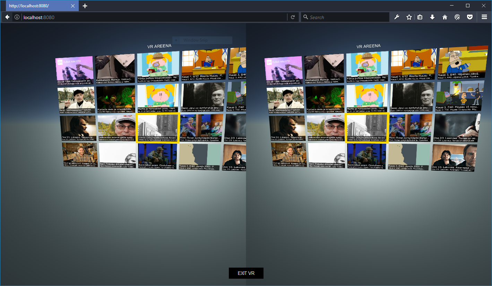

# yle-areena-webvr-player
This unofficial WebVR player for Yle Areena written mostly in Javascript ES6. 

See it running over here:
https://www.youtube.com/watch?v=Q7u2ixWybUw

Program consist of two main Javascript modules:
* dist/server.js, Node module for hosting index.html + client.js and acting as CORS proxy to access YLE Rest API and video stream 
* dist/client.js, script executed in browser implementing THE player using THREE.JS

## Features
* Select a program from grid menu containing program title and description.  
* Playback of program

## Requirements
* Node >= 6.5.0
* WebVR enabled browser (tested with Firefox 54.0a2 (2017-04-01))
* Yle Developer keys (register at http://developer.yle.fi/index.en.html)

## Running

* clone repository
* change YLE developer keys to Yle Developer keys to @ src/client/yle_config.js
* npm update
* npm run-script build
* node dist/server.js (web server should be now running at localhost:8080)
* open browser to localhost:8080, clicking mouse button will open program or exit player

  

